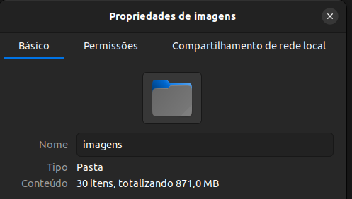
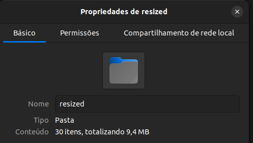

# Redimensionar imagens para inserir em relatórios

*Autor:* **Israel Oliveira**

*Formação:* **Engº Agrônomo**

*YouTube:* **@israel_oliveira**

*Instituição:* **INCRA - Bahia.**

- As fotos tiradas com uma alta definição ao serem inseridas em relatórios com uma alta quantidade de imagens geral arquivos .pdf ou de texto muito pesado. Isso ocorre também nos relatórios salvos com .html ou confeccionados em sistemas web.
- O script python vai redimensionar as imagens mantendo sua orientação para o padrão, ou seja, retrato ou paisagem;
- Salve o script na pasta de fotos e rode o camando
- Abras o script e coloque o caminho para a pasta de fotos

~~~
 if __name__ == '__main__':
   # coloque o caminho para a pasta de imagens que deseja redimensionar
   root_folder = './imagens'
   main(root_folder)
~~~

- Rode o comando no terminal

> `python3 image_resize.py`

## Requerimentos

- Pillow 10.0.0
  
 > `pip install Pillow`

## Resultados

O processo resulta em arquivos menores.

#### Pasta com arquivos originais (871,0MB)

#### Pasta com arquivos redimensionados (9,4MB)

